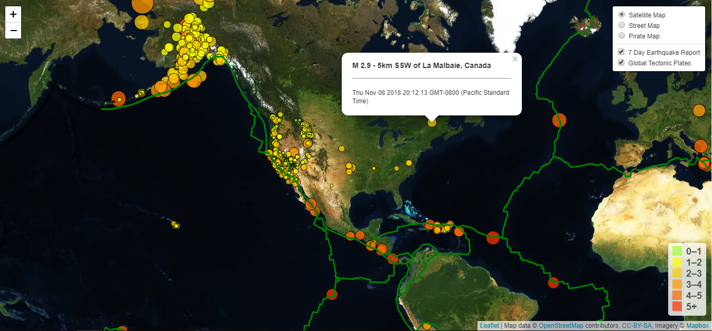

# Earthquake_Visualization

please use this [link](https://belfman.github.io/Earthquake_Visualization/index.html "link to 7 Day Earthquake Report") to view the complete page with interactivity.

## Static Preview
I created a page using HTML/CSS/JS with bootstap, D3.js, and leaflet to visualize recent earthquake activity over the 7 most recent days. Each earthquake is marked on the map with a circle and the radius of the circle corresponds
to the magnitude. There is a pop up for each circle which lists the magnitude, location, and date. Fault lines can be toggled on and off, and there are 
three different base maps to view. 

